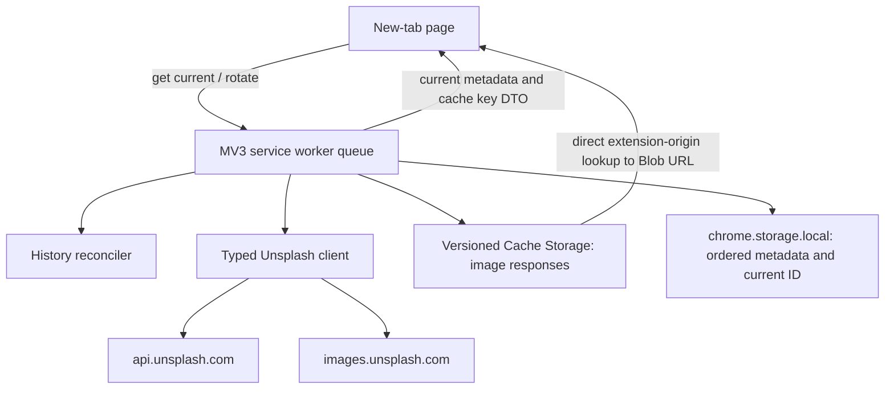
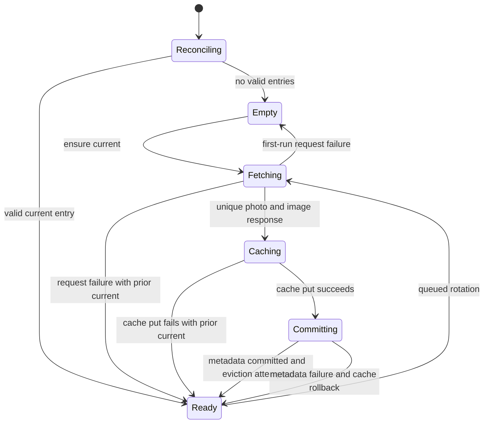

# Cached New Tab Image History - Plan

## Goal Capsule

- **Objective:** Every new tab shows a usable Stellar Photos image whenever a cached or network image is available, otherwise it remains usable in a neutral recovery state, and the extension retains a reliable local history of up to 10 images.
- **Means:** Call Unsplash directly, store image responses in Cache Storage, keep ordered metadata in extension storage, and migrate the active extension to TypeScript (KTD1, KTD2, KTD3).
- **Authority:** The Product Contract owns behavior. The Planning Contract owns implementation choices. Unsplash's current API contract and the application's production approval constrain the integration.
- **Execution profile:** Code changes with unit, integration, build, and unpacked-extension verification.
- **Stop conditions:** Stop if concrete new evidence contradicts the confirmed production approval, if the production key is unavailable to the build, or if a supported target browser cannot retrieve cached responses from an extension page.
- **Tail ownership:** The implementer owns active-code migration, tests, build repair, and browser smoke verification. Shipping and deletion of legacy code are separate work.

---

## Product Contract

### Summary

The active extension will display cached Unsplash images on new-tab pages and maintain a newest-first history of no more than 10 unique images. It will call Unsplash directly with a bundled production access key and will leave a typed credential boundary for a future user-supplied key.

### Problem Frame

The active extension currently expects a proxy-provided base64 field, stores only one JSON image record, and uses JavaScript that is copied to the distribution unchanged. Direct Unsplash responses contain image URLs instead of base64 data, and rapid new-tab events can race while a Manifest V3 service worker updates storage. The extension needs durable binary storage, recoverable metadata, deterministic rotation, and an executable TypeScript build.

### Key Decisions

- **Call Unsplash directly with a bundled access key.** (session-settled: user-directed — chosen over a private proxy: Stellar Photos has production approval for its direct integration.) Governs R2, R3, R9.
- **Keep up to 10 downloaded images in Cache Storage.** (session-settled: user-directed — chosen over base64 data in extension storage: binary responses should remain outside JSON storage and support local history.) Governs R4, R5, R6, R7.
- **Migrate only the active implementation to TypeScript.** (session-settled: user-directed — chosen over continuing the JavaScript rewrite or restoring legacy code: the active extension needs typed contracts while `old/` remains a later deletion target.) Governs R1, R10.

### Requirements

**TypeScript and distribution**

- R1. All active extension and build logic must be authored in TypeScript and compiled into browser-executable JavaScript.
- R2. Production builds must embed the approved Unsplash access key without committing a second secret key or depending on the removed proxy.
- R3. The API boundary must prefer a future user access-key override when present and otherwise use the bundled key.

**Image cache and history**

- R4. Cache Storage must contain the downloaded response for every retained history image.
- R5. Local extension storage must contain a newest-first metadata history with at most 10 unique Unsplash photo IDs and a current image ID that refers to the first entry.
- R6. Cache Storage and metadata must never retain more than 10 Stellar Photos history images; a promotion at capacity must reserve space before inserting its response.
- R7. Startup reconciliation must repair missing responses, orphan responses, duplicate metadata, invalid current IDs, and histories above the limit without touching `old/`.

**New-tab behavior**

- R8. A new tab with a current cached image must render it immediately and queue one serialized rotation for a later tab.
- R9. A first-run tab with no usable cached image must fetch, cache, promote, and render one image without issuing a second rotation for the same opening.
- R10. Network, API, tracking, cache, or metadata failures must not remove the last usable current image or make the new-tab page unusable.
- R11. The page must render cached responses through a revocable object URL on a full-viewport background with a neutral loading or failure state.

**Unsplash integration**

- R12. Retained metadata must support photographer and Unsplash attribution and must retain the photo's download-tracking location.
- R13. A successful promotion must trigger the returned download-tracking location as a best-effort action whose failure does not roll back the image.
- R14. API, image, redirect, and tracking URLs must use HTTPS and match the same code-owned Unsplash origin allowlists declared in the extension manifest.
- R15. Persisted history must use a versioned schema that distinguishes absent, supported, malformed, and unsupported future state without silently overwriting unknown data.
- R16. Release builds must support the current and previous stable Chrome/Chromium and Firefox releases at release time through browser-specific Manifest V3 background configurations.

### Key Flows

- F1. Established new tab
  - **Trigger:** A new-tab page opens while a valid current image exists.
  - **Steps:** The page reads and renders the current cached response, then requests a background rotation. The service worker serializes the request, promotes a unique replacement, and trims history.
  - **Outcome:** The current tab keeps its rendered image, and the replacement becomes current for the next tab.
  - **Covered by:** R4, R5, R6, R8, R10, R11.
- F2. Empty first run
  - **Trigger:** A new-tab page opens with no valid current image.
  - **Steps:** The page requests an ensured current image and waits in a neutral state. The service worker fetches and promotes one image, then returns its identity for rendering.
  - **Outcome:** The first tab shows one image and performs only one image acquisition.
  - **Covered by:** R4, R5, R9, R10, R11.
- F3. Recovery
  - **Trigger:** The service worker starts or receives its first command with inconsistent cache and metadata state.
  - **Steps:** Reconciliation removes invalid metadata and orphan responses, deduplicates and caps history, and selects the newest surviving current image.
  - **Outcome:** Later display and rotation operations start from a consistent bounded state.
  - **Covered by:** R5, R7, R10.

### Acceptance Examples

- AE1. Established cached display
  - **Covers:** R8, R11.
  - **Given:** Image A is the valid current cached image.
  - **When:** A new tab opens while the replacement request is still pending.
  - **Then:** The tab displays Image A before the network request resolves.
- AE2. Bounded history
  - **Covers:** R5, R6.
  - **Given:** Ten unique cached images exist in newest-first order.
  - **When:** Image K is promoted successfully.
  - **Then:** Image K becomes current, the oldest metadata and response are removed, and exactly 10 entries remain.
- AE3. Failed rotation
  - **Covers:** R10.
  - **Given:** A valid current image exists.
  - **When:** the API request, image request, cache write, or metadata commit fails.
  - **Then:** The existing image remains current and renderable.
- AE4. Concurrent tabs
  - **Covers:** R5, R6, R8.
  - **Given:** Several tabs open before the first rotation finishes.
  - **When:** Their rotation commands reach the service worker.
  - **Then:** Mutations run serially, at most one rotation remains pending behind the active rotation, history remains unique and bounded, and no committed metadata points at a missing response.

### Success Criteria

- Fresh and established installations display an image whenever at least one network or cached image is available.
- Ten successful unique promotions leave exactly 10 matching metadata and cache entries after reconciliation.
- Type checking, automated tests, and all supported browser builds pass without compiling or modifying `old/`.

### Scope Boundaries

#### In scope

- Active `src/` code, manifest, static new-tab presentation, build tooling, tests, package scripts, and current developer commands.
- A credential resolver that can read a future override, without exposing a settings interface now.
- Cache/history reconciliation and rapid-tab serialization.

#### Deferred to Follow-Up Work

- A settings UI for entering, validating, replacing, or removing a user-supplied Unsplash access key.
- User-facing history controls beyond preserving the ordered data needed for the feature.
- Deletion of `old/` and any migration of features from it.

### Dependencies

- Stellar Photos has production approval for its direct Unsplash integration, bundled access key, cached images, and new-tab experience. This is a settled project fact unless concrete contradictory evidence appears.
- The release environment supplies the approved access key to the build.
- The current and previous stable Chrome/Chromium and Firefox releases support Cache Storage, Blob object URLs, and their selected Manifest V3 background context.

---

## Planning Contract

### Key Technical Decisions

- KTD1. **Compile independent active TypeScript entry points with esbuild.** (session-settled: user-directed — chosen over browser-loaded JavaScript source: all active implementation and build logic must be typed per R1, R10, and R16.) New-tab and background entry points emit self-contained browser bundles at stable `dist/js/*.js` paths with no runtime shared chunk. Browser-specific manifests select a service worker for Chrome and a non-persistent background script for Firefox. The build injects a typed access-key constant, copies static assets, type-checks separately, and excludes `old/`.
- KTD2. **Resolve credentials through one typed provider.** (session-settled: user-directed — chosen over a proxy-owned credential: direct requests use the approved bundled key while retaining the future override seam required by R2 and R3.) Production builds fail when the bundled key is missing. The distributed JavaScript contains the key by design.
- KTD3. **Split binary responses from versioned ordered metadata.** (session-settled: user-directed — chosen over base64 storage: Cache Storage owns image bytes while local extension storage owns the 10-entry history required by R4-R7 and R15.) Use a narrowly prefixed versioned cache and a strict versioned metadata envelope. One canonical key function maps each validated photo ID to an encoded synthetic HTTPS request; all cache operations use that function. Unknown future metadata versions fail closed without mutation.
- KTD4. **Serialize every persistence operation in a rejection-safe service-worker queue.** All initialization, ensure, rotate, and reconcile operations append to one module-scoped tail. Each caller receives its own result, while a normalized settled tail prevents one rejected operation from poisoning later commands. A queued memoized initialization prevents concurrent first commands from overtaking or duplicating reconciliation.
- KTD5. **Reserve capacity and commit promotion in recoverable order.** Promotion fetches and validates metadata and image bytes before mutation. At the 10-image limit, it commits a nine-entry snapshot and removes the oldest response; failure to reserve capacity aborts the promotion. It then writes the new response and commits the 10-entry snapshot. A failed final commit deletes only a newly created key or restores a prior response, leaving the verified nine-entry snapshot usable.
- KTD6. **Keep history unique by Unsplash photo ID.** A duplicate random result receives a bounded retry. Exhausted retries preserve the current state instead of inserting a duplicate or looping without limit.
- KTD7. **Render from a Blob object URL.** The page clones or reads the cached response, creates an object URL, sets the background, and revokes the URL on replacement or unload.
- KTD8. **Treat download tracking as best effort after promotion.** The authenticated request uses the returned `download_location`. Its failure is logged but does not invalidate a downloaded image.
- KTD9. **Keep runtime messages structured-clone safe and credential free.** Commands and results contain typed metadata, canonical cache keys, and typed errors. Responses, Blobs, object URLs, bundled keys, and future override values never cross the message boundary. The listener keeps the response channel alive synchronously and answers exactly once after queued work settles.
- KTD10. **Use snapshot-then-promote rotation with a one-pending-refresh bound.** History head is the only persisted current pointer. Each established opening snapshots the head and requests promotion for later openings. Concurrent requests share the active rotation and create at most one pending follow-up, preventing unbounded API and cache churn.
- KTD11. **Validate every remote response within fixed trust and resource bounds.** Parse API-provided URLs, require HTTPS, reject credentials and unexpected ports, enforce code-owned API and image origin allowlists before and after redirects, and reject image bodies above 20 MiB before cache promotion.

### High-Level Technical Design

### Sequencing

1. Establish the TypeScript build and test harness before changing runtime contracts.
2. Add typed API, credential, metadata, and Cache Storage boundaries.
3. Implement serialized history mutation and service-worker messaging.
4. Migrate new-tab rendering to the cached-response contract.
5. Complete integration coverage and unpacked-extension verification.

### System-Wide Impact

- **Storage lifecycle:** Cache Storage and local metadata form one logical store without transactions. Reconciliation is part of normal startup, not an optional repair tool.
- **Integrity invariant:** A committed supported snapshot contains at most 10 unique IDs, names its first entry as current, carries complete attribution and tracking metadata, and maps every entry to one validated response through the canonical key function.
- **Security and release:** The access key is intentionally recoverable from the shipped bundle. Build logs and source control must not expose any secret key, and production builds must use the approved access key.
- **Rate limits:** Duplicate retries and rapid new tabs consume API capacity. Serialization, bounded retries, and KTD10 cap request amplification.
- **Browser permissions:** Direct metadata, image, and tracking requests require narrow host permissions for Unsplash API and image origins.

### Risks and Mitigations

- **Partial cache/metadata commits:** Use KTD5. Reconciliation inventories both stores without mutation, aborts on uncertain reads, commits and verifies a candidate snapshot, and only then deletes unreferenced responses.
- **Service-worker suspension:** Keep the message channel open through asynchronous work and avoid untracked promises.
- **Queue poisoning:** Normalize the queue tail after every command and prove a failed command cannot block later work.
- **Duplicate random results:** Apply KTD6 and test bounded exhaustion.
- **Object URL leaks:** Centralize background replacement and revoke URLs per KTD7.
- **API or CDN contract drift:** Validate only documented fields needed by R4 and R12, and surface actionable errors without clearing current state.
- **Dirty worktree overlap:** Preserve the existing edits in `src/ts/requests.js` and `src/ts/settings.js` when converting them; do not alter the existing `_src/` deletions or `old/` additions.
- **Cache-version drift:** Inspect only narrowly owned Stellar Photos cache names. Establish valid active state before deleting superseded owned versions.
- **Untrusted remote URLs or oversized bodies:** Apply KTD11 before sending credentials, following redirects, allocating full bodies, or writing cache entries.

---

## Implementation Units

### U1. TypeScript build and test foundation

- **Goal:** Produce browser-runnable JavaScript from typed active sources and establish executable quality gates.
- **Requirements:** R1, R10.
- **Dependencies:** None.
- **Files:** `package.json`, `bun.lock`, `package-lock.json`, `tsconfig.json`, `build.ts`, `build.js`, `justfile`, `src/index.html`, `src/manifest.json`, `tests/build.test.ts`.
- **Approach:**
  1. Standardize the active workflow on Bun, TypeScript, esbuild, browser API typings, and Bun's test runner.
  2. Replace the copy-only build with independent new-tab and background bundles, Chrome service-worker and Firefox event-page manifests, and static asset copying while keeping emitted script paths stable.
  3. Add typecheck, test, development, and production scripts and repair root-level task paths.
  4. Remove the superseded active JavaScript build file after `build.ts` owns the pipeline; leave `old/` untouched.
- **Execution note:** Establish build and smoke proof before migrating runtime modules so each later unit has a reliable feedback loop.
- **Patterns to follow:** Preserve the simple `src/` to `dist/` packaging boundary in the current `build.js`; recover only the relevant esbuild ideas from repository history, not code from `old/`.
- **Test scenarios:**
  - A production build with a valid access key emits `dist/js/init.js`, `dist/js/service-worker.js`, the manifest, HTML, and icons without copying TypeScript source.
  - A production build without the required key fails with an actionable build error.
  - Type checking and test discovery include active source and tests but exclude `old/`.
  - The emitted HTML and manifest reference files that exist in `dist/`.
  - Each emitted entry point contains no unresolved runtime import, TypeScript syntax, source `.ts` reference, shared runtime chunk, or `old/` reference.
  - Production source maps are disabled, build logs never print credential values, and automated fixtures use sentinel keys rather than production credentials.
  - Generated manifests declare the oldest current-or-previous stable browser version exercised by the release matrix and select the correct background context.
- **Verification:** Active source type-checks, the test runner executes real tests, and the built directory can be loaded as an unpacked extension.

### U2. Typed Unsplash and persistence contracts

- **Goal:** Define the trusted shapes and boundaries used by API, settings, metadata storage, and Cache Storage.
- **Requirements:** R2-R5, R12, R14, R15.
- **Dependencies:** U1.
- **Files:** `src/ts/types.ts`, `src/ts/settings.ts`, `src/ts/storage.ts`, `src/ts/requests.ts`, `src/ts/cache.ts`, `src/manifest.json`, `tests/settings.test.ts`, `tests/requests.test.ts`, `tests/cache.test.ts`.
- **Approach:**
  1. Define the minimal documented Unsplash response, retained photo metadata, history state, commands, and result/error types.
  2. Replace stored endpoint strings with code-owned endpoint construction and merge missing defaults without overwriting existing preferences.
  3. Implement KTD2 with override-first credential resolution and authenticated API requests.
  4. Implement KTD3 with a strict versioned metadata decoder, narrowly owned cache versions, canonical photo keys, response validation, lookup, put, and delete operations.
  5. Apply KTD11 and add the same narrow Unsplash API and image CDN origins to code-owned allowlists and browser manifests.
  6. Keep a future user key in local extension storage, never synchronized storage, and prevent its value from entering logs, messages, source maps, or build artifacts.
- **Execution note:** Start with contract tests for authentication, response validation, and cache lookup before replacing existing modules.
- **Patterns to follow:** Retain the promise-based `Storage` wrapper pattern from `src/ts/storage.js`, but use typed Promise overloads supported by current browser APIs.
- **Test scenarios:**
  - The future override key takes precedence over the bundled key, while an absent override uses the bundle.
  - Missing credentials prevent API calls and return a typed failure.
  - Random-photo and download-tracking calls send public authentication and API version headers to the returned documented URLs.
  - A malformed Unsplash response or non-image CDN response is rejected before persistence.
  - Hostile origins, non-HTTPS and credential-bearing URLs, unexpected ports, and redirects outside the allowlist are rejected before privileged use.
  - Declared or streamed image bodies above 20 MiB are rejected while the previous current image remains intact.
  - Cache put, match, and delete use stable versioned keys and preserve response content types.
  - Distinct accepted IDs, including separator and escaped characters, map to distinct canonical keys; empty, oversized, or invalid IDs are rejected.
  - Absent, supported inconsistent, malformed, and unsupported future metadata states remain distinguishable; an unsupported version causes no mutation.
  - Upgrade initialization fills missing defaults without changing existing preferences or history.
- **Verification:** No active runtime module depends on proxy endpoints or a base64 image field, and every remote request is covered by manifest permissions.

### U3. Bounded cache history and reconciliation

- **Goal:** Maintain one recoverable, newest-first history whose metadata and cached responses stay aligned.
- **Requirements:** R4-R7, R10, R12, R13.
- **Dependencies:** U2.
- **Files:** `src/ts/history.ts`, `src/ts/actions.ts`, `tests/history.test.ts`, `tests/actions.test.ts`.
- **Approach:**
  1. Centralize history reads, promotion, trimming, and current selection behind one service-worker-owned boundary.
  2. Apply KTD5 for promotion and rollback, retaining attribution and tracking metadata.
  3. Apply KTD6 with a three-attempt duplicate retry budget, then leave the current state unchanged.
  4. Reconcile through KTD4 before the first stateful command. Treat stored array order as newest-first, keep the first valid occurrence of each ID, cap at ten, and select the first survivor as current.
  5. Inventory before mutation, abort on uncertain reads, commit and re-read the repaired snapshot, then remove unreferenced entries and superseded owned cache versions.
  6. Treat the active legacy single-image record as non-authoritative. Remove it only after a valid versioned history snapshot is established; do not read from or modify `old/`.
  7. Trigger download tracking after a successful promotion per KTD8.
- **Execution note:** Implement mutation and reconciliation tests before wiring browser events because Cache Storage and extension storage do not share a transaction.
- **Patterns to follow:** Keep `setNextImage`'s high-level fetch-and-store responsibility from `src/ts/actions.js`, but replace its unawaited single-record write with the typed history boundary.
- **Test scenarios:**
  - Covers AE2. Promoting an eleventh unique image removes the oldest metadata and cached response and leaves ten aligned entries.
  - A duplicate ID is never inserted twice; a unique retry is promoted, and three duplicate results preserve state.
  - API, image fetch, cache put, and metadata commit failures each retain the previous current image.
  - A metadata failure after cache put deletes only a newly created key or restores a replaced response; a pre-existing orphan response is not destroyed.
  - Reconciliation storage failure performs no cache deletion and preserves every response referenced by the prior committed snapshot.
  - Failure to delete the oldest response aborts a capacity reservation without writing an eleventh response.
  - Failure after a successful capacity reservation leaves a verified nine-entry snapshot with the previous current image intact.
  - Covers F3. Reconciliation repairs missing responses, orphans, duplicate IDs, more than ten entries, invalid current ID, and fully empty state.
  - Duplicate IDs with conflicting metadata keep the first valid newest entry deterministically.
  - An owned superseded cache version is removed only after active metadata is safely established.
  - Tracking receives the retained `download_location`; tracking failure leaves the promotion committed.
- **Verification:** After every successful mutation or reconciliation, current ID equals the newest entry and every history cache key resolves to one image response.

### U4. Service-worker command lifecycle and concurrency

- **Goal:** Make first-run, rotation, and recovery commands reliable under Manifest V3 lifetime and rapid-tab concurrency.
- **Requirements:** R5-R10, R13.
- **Dependencies:** U3.
- **Files:** `src/ts/service-worker.ts`, `src/ts/actions.ts`, `src/ts/types.ts`, `tests/service-worker.test.ts`.
- **Approach:**
  1. Replace dynamic unchecked dispatch with a typed command protocol for ensure-current and rotate.
  2. Run memoized initialization and every mutation through the KTD4 promise queue.
  3. Apply KTD9 so each message channel remains alive until it receives exactly one typed result.
  4. Keep preferences and history under separate storage keys so queued install or update initialization cannot overwrite history from a stale read.
- **Test scenarios:**
  - Covers AE4. Concurrent rotation commands execute serially without lost updates, duplicate history, orphan responses, or a history above 10, while active requests share one rotation and permit at most one pending follow-up.
  - An ensure-current command on empty state fetches and promotes exactly one image.
  - An ensure-current command with valid state returns it without fetching.
  - Unknown and malformed commands return controlled errors and do not mutate state.
  - The message channel remains active until success or failure is delivered.
  - A failed queued command does not poison the next command, and every concurrent command receives exactly one response.
  - Concurrent first commands share one initialization and cannot overtake reconciliation.
  - Install or update initialization interleaved with promotion preserves the serialized history result and existing preferences.
  - Installation and upgrade initialization preserve existing preferences and valid history.
- **Verification:** Rapid command integration tests produce deterministic history snapshots, and no service-worker operation relies on an unawaited storage or fetch promise.

### U5. Cached new-tab rendering

- **Goal:** Render a full-page cached image on every viable new-tab opening and preserve it during background failures.
- **Requirements:** R8-R12.
- **Dependencies:** U2, U4.
- **Files:** `src/ts/init.ts`, `src/index.html`, `src/css/new-tab.css`, `tests/init.test.ts`.
- **Approach:**
  1. On established state, optimistically read current metadata and its cached response, render the snapshot, then request rotation for a later tab.
  2. Fall back to the worker's ensure-current command when the optimistic metadata or response is missing or malformed. Resolve the returned cache key from the page's own Cache Storage context.
  3. On empty state, show a neutral loading surface, await ensure-current, and render that one result without a same-opening rotation.
  4. Apply KTD7 and revoke object URLs on replacement and unload.
  5. Use a full-viewport centered cover treatment. On first-run failure, show a concise status and a retry control that issues one ensure-current request at a time and announces state changes accessibly.
  6. Preserve attribution-ready metadata for the later history interface without restoring legacy UI.
- **Test scenarios:**
  - Covers AE1. A cached current image renders before a pending rotate operation resolves.
  - Covers F2. Empty state requests one ensured image, renders it, and does not issue a second rotation.
  - A missing cached response is treated as empty state and recovered through the worker.
  - A cached body that fails image decoding is treated as unusable and gets one ensure-current recovery attempt without a second rotation.
  - Covers AE3. A failed background rotation does not clear or replace the rendered current image.
  - Metadata promoted after an optimistic read does not invalidate the response already resolved for the current tab.
  - Blob object URLs are created from cached responses and revoked on replacement and unload.
  - The page occupies the viewport and retains its neutral fallback when no image can be obtained.
  - First-run failure exposes one retry action, prevents parallel retries, and transitions through loading, success, and repeated-failure states without clearing a valid image.
- **Verification:** Fresh, cached, offline-with-cache, and failed-rotation states each produce the specified visible outcome without uncaught errors.

### U6. End-to-end history and browser verification

- **Goal:** Prove the complete API-to-cache-to-tab lifecycle and document the active development workflow.
- **Requirements:** R1-R14.
- **Dependencies:** U1-U5.
- **Files:** `tests/new-tab.integration.test.ts`, `README.md`, `CONTRIBUTING.md`, `justfile`.
- **Approach:**
  1. Add an integration harness with mocked Unsplash, Cache Storage, extension storage, and runtime messaging boundaries.
  2. Cover fresh install, established rotation, cap enforcement, failure retention, reconciliation, and concurrent openings.
  3. Update build and contribution instructions to the root-level TypeScript workflow and direct API configuration.
  4. Verify the production build as an unpacked extension in each supported browser family without touching `old/`.
- **Execution note:** Prefer runtime smoke evidence for browser packaging in addition to automated contract coverage.
- **Test scenarios:**
  - A fresh installation opens a tab, caches and renders one image, and records matching current metadata.
  - Repeated established openings rotate unique images and retain exactly the ten newest matching responses.
  - Rapid openings satisfy AE4 and may share the pre-rotation current while one active and at most one pending replacement complete.
  - Offline opening renders the current cached image without attempting to clear history.
  - Reloading after simulated partial commits reconciles state before the next mutation.
  - Current and previous stable Chrome/Chromium packages load their new-tab and service-worker entry points, and equivalent Firefox packages load their new-tab and event-page entry points, without runtime module errors.
- **Verification:** Automated integration tests pass, documentation matches executable commands, and manual browser evidence covers first run, repeated tabs, offline cache, and rapid-tab behavior.

---

## Verification Contract

| Gate | Applies to | Required outcome |
|---|---|---|
| `bun run typecheck` | U1-U6 | Active TypeScript and tests compile with no errors; `old/` is excluded. |
| `bun test` | U1-U6 | Unit and integration scenarios pass with deterministic mocked browser and Unsplash boundaries. |
| `bun run chrome:prod` | U1, U6 | A complete Chrome/Chromium extension is emitted with the production key and service-worker manifest configured. |
| `bun run firefox:prod` | U1, U6 | A complete Firefox extension is emitted with the production key and event-page manifest configured. |
| Unpacked-extension smoke test | U4-U6 | First run, repeated tabs, offline-with-cache, and rapid openings satisfy the acceptance examples. |

External network calls must be mocked in automated tests. The unpacked-extension smoke test may use the approved production application within its rate limits.

---

## Definition of Done

- Every requirement is implemented and covered by its owning unit's scenarios.
- Active source and build logic are TypeScript; `dist/` contains browser-runnable JavaScript and required static assets.
- Cache Storage and metadata retain no more than 10 history images after every settled promotion or reconciliation; failure to reserve capacity preserves the prior bounded state.
- Local history is unique, newest-first, and aligned with the cache; current ID names the first valid entry.
- Fresh, established, offline-with-cache, failed-rotation, partial-commit, and concurrent-tab flows meet their acceptance outcomes.
- Direct Unsplash requests authenticate with the approved bundled key, retain attribution data, and invoke download tracking after promotion.
- Remote URLs remain inside code-owned HTTPS allowlists, image bodies do not exceed 20 MiB, and credential values do not enter logs, messages, source maps, or test fixtures.
- Current and previous stable Chrome/Chromium and Firefox releases pass their browser-specific Manifest V3 build and smoke gates.
- Existing edits in active request and settings code are preserved through migration; unrelated `_src/` and `old/` worktree changes remain untouched.
- README and contribution instructions describe the working TypeScript build and key configuration.
- No abandoned JavaScript implementation, dead proxy route, base64 path, experimental code, or unused build dependency remains in the active implementation.

---

## Appendix

### Sources and Research

- `src/ts/init.js`, `src/ts/actions.js`, `src/ts/service-worker.js`, `src/ts/storage.js`, `src/ts/settings.js`, and `src/ts/requests.js` define the current active flow and migration surface.
- `src/manifest.json`, `src/index.html`, `build.js`, `package.json`, and `justfile` define packaging and runtime entry points.
- [Unsplash API documentation](https://unsplash.com/documentation) defines public authentication, random-photo responses, download tracking, attribution data, and image URLs.
- [Chrome cross-origin request guidance](https://developer.chrome.com/docs/extensions/develop/concepts/network-requests) defines manifest host permissions for API and CDN requests.
- [Chrome extension storage guidance](https://developer.chrome.com/docs/extensions/develop/concepts/storage-and-cookies) confirms Cache Storage availability in extension service workers and shared extension-origin storage.
- [MDN background manifest guidance](https://developer.mozilla.org/en-US/docs/Mozilla/Add-ons/WebExtensions/manifest.json/background) defines the Chrome service-worker and Firefox event-page split for cross-browser Manifest V3 packages.

No applicable repository learning documents were found under the resolved `docs/solutions/` location.
